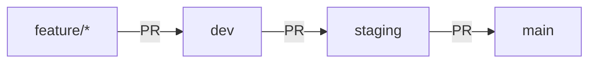
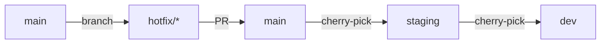

# Branch Deployment Strategy

## Overview
This document outlines the git branching and deployment strategy for the Blog-Poster project, covering both frontend (Vercel) and backend (Digital Ocean) deployments.

## Branch Structure

### Main Branches
1. **`main`** - Production branch
   - Protected branch with PR requirements
   - Auto-deploys to production environments
   - Frontend: https://blog-poster.projectassistant.ai
   - Backend: https://blog-poster-api-qps2l.ondigitalocean.app

2. **`staging`** - Staging/QA branch
   - Pre-production testing environment
   - Auto-deploys to staging environments
   - Frontend: https://staging.blog-poster.projectassistant.ai (Vercel preview)
   - Backend: https://blog-poster-api-staging.ondigitalocean.app (when configured)

3. **`dev`** - Development integration branch
   - Latest integrated features
   - Auto-deploys to dev environments
   - Frontend: https://dev.blog-poster.projectassistant.ai (Vercel preview)
   - Backend: Can use local or dev deployment

### Feature Branches
- **`feature/*`** - New features
- **`fix/*`** - Bug fixes
- **`hotfix/*`** - Emergency production fixes
- **`chore/*`** - Maintenance tasks

## Workflow

### Standard Development Flow


1. Create feature branch from `dev`
   ```bash
   git checkout dev
   git pull origin dev
   git checkout -b feature/your-feature-name
   ```

2. Develop and commit changes
   ```bash
   git add .
   git commit -m "feat: your feature description"
   ```

3. Push and create PR to `dev`
   ```bash
   git push -u origin feature/your-feature-name
   gh pr create --base dev
   ```

4. After dev testing, PR to `staging`
5. After staging approval, PR to `main`

### Hotfix Flow


## Environment Variables

### Frontend (Vercel)
Environment variables are managed per environment in Vercel:

#### Development
```bash
vercel env ls development
```

#### Staging/Preview
```bash
vercel env ls preview
```

#### Production
```bash
vercel env ls production
```

### Setup Scripts
- `frontend/setup-vercel-env.sh` - Production environment setup
- `frontend/setup-vercel-environments.sh` - All environments setup

### Backend (Digital Ocean)
Environment variables are set in the App Platform configuration:
- Edit via Digital Ocean dashboard or `doctl` CLI
- Stored in `app.yaml` for deployment

## Deployment Triggers

### Vercel (Frontend)
- **Production**: Pushes to `main` branch
- **Preview**: Pushes to any non-main branch
- **Development**: Pushes to `dev` branch

### Digital Ocean (Backend)
- **Production**: Pushes to `main` branch (auto-deploy enabled)
- **Staging**: Manual deployment or GitHub Actions (to be configured)
- **Development**: Local Docker or manual deployment

## CI/CD Configuration

### GitHub Actions
- PR checks run on all pull requests
- Tests must pass before merge
- Linting and type checking enforced

### Pre-deployment Checklist
- [ ] All tests passing
- [ ] Environment variables configured
- [ ] Database migrations run (if applicable)
- [ ] API documentation updated
- [ ] DEPLOYMENT_STATUS.md updated

## Commands Reference

### Switching Environments
```bash
# Frontend local development
npm run dev

# Backend local development
docker compose up

# Deploy frontend to production
cd frontend
vercel --prod

# Deploy backend to production
doctl apps create-deployment <app-id>
```

### Managing Environment Variables
```bash
# List all Vercel environments
cd frontend
./setup-vercel-environments.sh list

# Update specific environment
./setup-vercel-environments.sh dev|staging|production

# Update all environments
./setup-vercel-environments.sh all
```

## Rollback Procedures

### Frontend (Vercel)
```bash
# List recent deployments
vercel ls

# Rollback to specific deployment
vercel rollback <deployment-url>
```

### Backend (Digital Ocean)
```bash
# List deployments
doctl apps list-deployments <app-id>

# Rollback to previous deployment
doctl apps create-deployment <app-id> --rollback
```

## Best Practices

1. **Never commit directly to `main`** - Always use PRs
2. **Keep feature branches small** - Easier to review and test
3. **Update from base branch regularly** - Avoid merge conflicts
4. **Test in staging before production** - Catch issues early
5. **Document environment changes** - Update this file when needed
6. **Use semantic commit messages** - feat:, fix:, chore:, docs:
7. **Tag production releases** - For easy rollback reference

## Troubleshooting

### Vercel Deployment Issues
- Check environment variables: `vercel env ls production`
- Review build logs: `vercel logs <deployment-url>`
- Verify project link: `vercel project ls`

### Digital Ocean Deployment Issues
- Check app logs: `doctl apps logs <app-id>`
- Verify environment variables: `doctl apps config get <app-id>`
- Review deployment status: `doctl apps get-deployment <app-id> <deployment-id>`

## Contact
For deployment issues or questions, contact the DevOps team or check the project documentation.