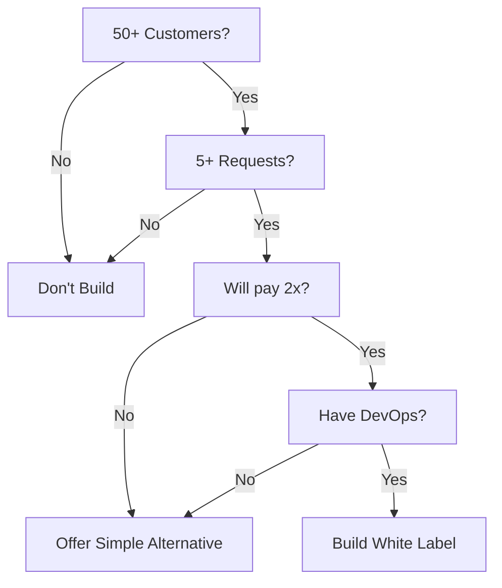

# White Labeling Implementation Guide

> **Status**: Future Feature (Not Required for MVP)
> **Estimated Implementation Cost**: $5,000-15,000
> **Recommended Customer Base**: 50+ paying customers minimum

## Executive Summary

White labeling allows customers to present your platform as their own branded solution. While attractive for agencies and enterprises, it adds significant technical complexity and ongoing maintenance burden. This guide outlines the full costs and considerations for implementing white labeling when the time is right.

## Cost Breakdown

### Technical Costs

#### 1. Custom Domain Support (~$500-2000 setup)
- **SSL Certificate Management**: Wildcard cert ~$200/year
- **DNS Configuration**: Complex routing setup
- **Options**:
  - Subdomain routing: `customer.yourdomain.com` (simpler)
  - Custom domain mapping: `app.customerdomain.com` (complex)
- **Tools Required**: Let's Encrypt, Cloudflare, or AWS Certificate Manager

#### 2. Dynamic Theming System (~$2000-5000 development)
- **Requirements**:
  - CSS variable system for colors/fonts
  - Logo upload and storage (Supabase Storage)
  - Theme preview/editor interface
  - Mobile responsive theme variations
  - Dark mode support per brand
- **Database Changes**:
  ```sql
  ALTER TABLE organizations ADD COLUMN branding JSONB DEFAULT '{
    "primary_color": "#667eea",
    "logo_url": null,
    "favicon_url": null,
    "font_family": "Inter",
    "custom_css": null
  }';
  ```

#### 3. Email Infrastructure (~$100-500/month)
- **Dedicated Email Service**: SendGrid/Postmark/Resend
- **Per-Customer Requirements**:
  - Custom SMTP configuration
  - SPF/DKIM/DMARC setup
  - Email template variables
  - Bounce handling per domain
- **Ongoing Costs**: $20-50 per custom domain

#### 4. Infrastructure Complexity
- **Multi-tenant Routing**: ~$1000-3000 development
- **CDN Configuration**: ~$50-200/month extra (Cloudflare Enterprise)
- **Database Overhead**: 20-30% more storage for branding assets
- **Caching Complexity**: Redis cache keys per brand

### Operational Costs

#### Support Overhead (+30-50% support time)
- DNS setup assistance (2-4 hours per customer)
- Custom domain debugging
- Theme customization support
- Email deliverability troubleshooting
- SSL certificate issues

#### Maintenance Burden
- SSL renewal automation
- Domain expiration monitoring
- Theme migration on platform updates
- Testing across multiple branded versions
- Performance monitoring per white label

#### Security & Compliance
- Separate security audits per white-label ($1000-5000 each)
- Data isolation verification
- Cookie consent per domain
- Privacy policy management
- GDPR compliance per brand

## Hidden Costs

### Development Velocity Impact (-20-30%)
Every new feature must:
- Work with dynamic theming
- Be tested across multiple brands
- Handle custom domain edge cases
- Support brand-specific configurations

### Technical Debt Accumulation
- URL routing complexity grows exponentially
- Asset management becomes complex
- Cache invalidation issues multiply
- Database queries need brand filtering
- CI/CD pipeline complexity increases

## Pricing Models

### Tier 1: Basic White Label ($99-299/month)
- Subdomain: `customer.blog-poster.com`
- Basic customization:
  - Logo replacement
  - Primary color scheme
  - Email from name
- "Powered by" removal
- Standard email templates

### Tier 2: Advanced White Label ($500-1500/month)
- Custom domain support
- Full theme customization:
  - All colors and fonts
  - Custom CSS injection
  - Multiple logo variants
- Custom email domain
- Remove ALL platform branding
- API white labeling

### Tier 3: Enterprise White Label ($2000+/month)
- Multiple domains per account
- Fully isolated infrastructure
- Custom mobile apps (React Native)
- Dedicated IP addresses
- SLA guarantees
- Priority support channel

## Real-World Pricing Examples

| Platform | Standard Price | White Label Price | Premium |
|----------|---------------|-------------------|---------|
| Calendly | $15/user/month | $25/user/month | +67% |
| Typeform | $25/month | $83/month | +232% |
| Jotform | $39/month | $999/year | +100% |
| Paperform | $29/month | $135/month | +365% |

## ROI Calculation

### Break-Even Analysis
```
Basic White Label:
- Implementation: $5,000
- Monthly overhead: $200
- Need: 5-10 customers at $100/month premium
- Break-even: 6-12 months

Advanced White Label:
- Implementation: $15,000
- Monthly overhead: $500
- Need: 10-20 customers at $200/month premium
- Break-even: 12-18 months

Enterprise:
- Implementation: $30,000+
- Monthly overhead: $1,000
- Need: 3-5 customers at $1,000/month premium
- Break-even: 18-24 months
```

## Implementation Decision Criteria

### Build White Labeling When:
- [ ] You have 50+ paying customers
- [ ] At least 5 customers have explicitly requested it
- [ ] They confirmed willingness to pay 2-3x base price
- [ ] You have dedicated DevOps resources
- [ ] Your core product is stable and mature
- [ ] You have $10,000+ budget for implementation
- [ ] You can afford 30% slower feature development

### Don't Build If:
- [ ] You have fewer than 50 customers
- [ ] Requests are vague ("would be nice to have")
- [ ] Your core product still needs work
- [ ] You're a solo developer or small team
- [ ] You're still iterating on product-market fit

## Alternative Solutions

### Option 1: "Powered by" Removal Only
**Cost**: $20-50/month premium
**Implementation**: 10 minutes
```typescript
{showBranding && !organization.hide_branding && (
  <PoweredByBadge />
)}
```

### Option 2: Basic Customization
**Cost**: $50-100/month premium
**Implementation**: 1 day
- Logo replacement
- Primary color variable
- Custom subdomain

### Option 3: Embed Mode
**Cost**: $100-200/month premium
**Implementation**: 1 week
- iframe embeddable
- PostMessage API
- Matches parent styling

### Option 4: Private Label Partnership
**Cost**: Revenue share (20-30%)
**Implementation**: Contract only
- They handle all branding
- You provide API access
- No technical changes needed

## Technical Implementation Guide

### Phase 1: Database Schema (Week 1)
```sql
-- Add branding configuration
CREATE TABLE white_label_configs (
  id UUID PRIMARY KEY,
  organization_id UUID REFERENCES organizations(id),
  domain TEXT UNIQUE,
  branding JSONB,
  ssl_certificate TEXT,
  verified BOOLEAN DEFAULT false,
  created_at TIMESTAMPTZ DEFAULT NOW()
);

-- Add indexes for performance
CREATE INDEX idx_white_label_domain ON white_label_configs(domain);
CREATE INDEX idx_white_label_org ON white_label_configs(organization_id);
```

### Phase 2: Domain Routing (Week 2)
```typescript
// middleware/whiteLabel.ts
export async function whiteLabel(req: Request) {
  const host = req.headers.get('host');
  
  if (host && !host.includes('blog-poster.com')) {
    const config = await getWhiteLabelConfig(host);
    if (config) {
      req.organization = config.organization_id;
      req.branding = config.branding;
    }
  }
}
```

### Phase 3: Dynamic Theming (Week 3)
```typescript
// components/ThemeProvider.tsx
export function ThemeProvider({ children, branding }) {
  const theme = useMemo(() => ({
    '--primary': branding?.primary_color || '#667eea',
    '--font-family': branding?.font_family || 'Inter',
    // ... other theme variables
  }), [branding]);

  return (
    <div style={theme}>
      {children}
    </div>
  );
}
```

### Phase 4: Email Customization (Week 4)
```typescript
// services/email.ts
export async function sendEmail(to: string, template: string, data: any) {
  const org = await getOrganization(data.organizationId);
  const branding = org.white_label_config;
  
  const emailData = {
    from: branding?.email_from || 'noreply@blog-poster.com',
    replyTo: branding?.email_reply || 'support@blog-poster.com',
    logo: branding?.logo_url || DEFAULT_LOGO,
    ...data
  };
  
  // Send via appropriate provider
}
```

## Maintenance Checklist

### Daily
- [ ] Monitor SSL certificate expiration
- [ ] Check custom domain health
- [ ] Review error logs for brand-specific issues

### Weekly
- [ ] Test each white label instance
- [ ] Verify email deliverability
- [ ] Check DNS propagation

### Monthly
- [ ] Audit security per white label
- [ ] Review usage and costs
- [ ] Update documentation
- [ ] Performance analysis per brand

## Common Pitfalls to Avoid

1. **Underestimating Complexity**: It's always 3x harder than expected
2. **Poor Isolation**: Data leaks between brands
3. **SSL Management**: Certificates expiring causing downtime
4. **Email Reputation**: One bad customer affects all
5. **Performance Degradation**: Not caching per brand
6. **Support Burden**: Not having self-service docs
7. **Pricing Too Low**: Not charging enough for the complexity

## Conclusion

White labeling can be a powerful differentiator and revenue driver, but it comes with significant technical and operational costs. The key is timing - implement it only when you have clear demand, sufficient resources, and a stable core product.

**Remember**: The real cost isn't the initial implementation - it's the permanent 30% tax on all future development and support.

## Quick Decision Framework



---

*Last Updated: January 2025*
*Next Review: When approaching 50 customers*