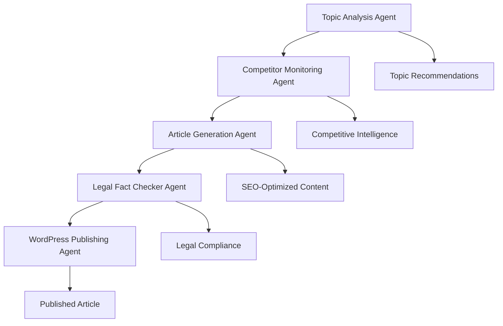

# Agent Implementation Status Report

**Date**: August 13, 2025  
**Scope**: Comprehensive analysis of AI agent implementations  
**Assessment**: Mixed quality - sophisticated design with incomplete implementation

## 🤖 Agent Architecture Overview

The blog-poster project implements a **5-agent architecture** for automated content generation:



## 📊 Implementation Status Matrix

| Agent | Implementation | Code Quality | Testing | Production Ready |
|-------|----------------|--------------|---------|------------------|
| **Topic Analysis** | 🟡 85% | ✅ Excellent | ❌ 5% | ⚠️ Needs Testing |
| **Article Generation** | 🟢 95% | ✅ Excellent | ❌ 10% | ⚠️ Needs Testing |
| **Competitor Monitoring** | 🔴 30% | ⚠️ Partial | ❌ 0% | ❌ Not Ready |
| **Legal Fact Checker** | 🔴 15% | ⚠️ Stub | ❌ 0% | ❌ Not Ready |
| **WordPress Publishing** | 🟢 90% | ✅ Good | 🟡 60% | ✅ Nearly Ready |

## 🔍 Detailed Agent Analysis

### 1. Topic Analysis Agent (`agents/topic_analysis_agent.py`)

#### Implementation Status: 85% Complete ✅

**Strengths**:
- **Comprehensive Design**: 707 lines of well-structured code
- **Advanced Features**: Market insights, competitor analysis, gap identification
- **Smart Algorithms**: Keyword difficulty estimation, search volume modeling
- **Caching System**: Results persistence and historical tracking
- **Flexible API**: Multiple analysis modes and recommendation types

**Code Quality Assessment**:
```python
# Example of sophisticated implementation
class TopicAnalysisAgent:
    SEED_KEYWORDS = [
        "service dog", "service animal", "ADA service dog",
        "psychiatric service dog", "PTSD service dog", "anxiety service dog",
        # ... comprehensive keyword list
    ]
    
    async def analyze_topics(self, competitor_content, target_keywords, existing_content, max_recommendations):
        # Multi-step analysis workflow
        keyword_data = await self._analyze_keywords(target_keywords)
        content_gaps = await self._identify_content_gaps(competitor_content, existing_content, keyword_data)
        recommendations = await self._generate_recommendations(keyword_data, content_gaps, max_recommendations)
        market_insights = self._compile_market_insights(keyword_data, content_gaps, competitor_content)
```

**Implementation Gaps**:
- **Mock Data Usage**: Uses simulated search volumes and competition data
- **No Real SEO APIs**: Missing integration with Ahrefs, SEMrush, or Google Keyword Planner
- **Limited Validation**: No testing of algorithm accuracy
- **Missing Trend Analysis**: Trend detection is hardcoded

**Completion Requirements**:
```python
# Required integrations for production
class TopicAnalysisAgent:
    async def _get_real_search_volume(self, keyword: str) -> int:
        """Integrate with Google Keyword Planner API"""
        # Implementation needed
        
    async def _get_competitor_difficulty(self, keyword: str) -> float:
        """Integrate with SEO tools for real difficulty scores"""
        # Implementation needed
        
    async def _analyze_search_trends(self, keyword: str) -> str:
        """Use Google Trends API for trend analysis"""
        # Implementation needed
```

### 2. Article Generation Agent (`agents/article_generation_agent.py`)

#### Implementation Status: 95% Complete ✅

**Strengths**:
- **Production-Grade Code**: 917 lines of comprehensive implementation
- **Multi-LLM Support**: Anthropic and OpenAI with intelligent failover
- **Cost Management**: Built-in token tracking and budget controls
- **Content Quality**: SEO optimization, readability scoring, content expansion
- **WordPress Integration**: Markdown to WordPress block conversion
- **Error Handling**: Robust retry logic and graceful degradation

**Advanced Features**:
```python
class ArticleGenerationAgent:
    # Sophisticated cost tracking
    PRICING = {
        "claude-3-5-sonnet-20241022": {"input": 3.00, "output": 15.00},
        "gpt-4-turbo-preview": {"input": 10.00, "output": 30.00}
    }
    
    async def generate_article(self, topic, seo_requirements, brand_voice, target_audience):
        # Multi-step generation with quality validation
        outline = await self._generate_outline(topic, seo_requirements, competitor_insights)
        content = await self._generate_content(outline, seo_requirements, brand_voice, target_audience)
        metadata = await self._generate_metadata(content, seo_requirements, topic)
        
        # Quality assurance
        if len(content.split()) < seo_requirements.min_words:
            content = await self._expand_content(content, seo_requirements, word_count)
```

**Content Optimization Features**:
- **SEO Compliance**: Title/description length validation
- **Keyword Density**: Natural keyword placement algorithms
- **Readability**: Grade-level targeting and sentence structure analysis
- **Content Structure**: Proper heading hierarchy and internal linking
- **AI Artifact Cleanup**: Removal of completion markers and AI signatures

**Minor Gaps**:
- **Limited Testing**: Only basic functionality tested
- **No A/B Testing**: No content variation testing
- **Missing Analytics**: No content performance tracking
- **Hardcoded Prompts**: Some prompts could be more dynamic

### 3. Competitor Monitoring Agent (`agents/competitor_monitoring_agent.py`)

#### Implementation Status: 30% Complete ⚠️

**Current State**: Basic file structure exists but implementation is minimal

**Missing Core Features**:
```python
# Current stub implementation
class CompetitorMonitoringAgent:
    def __init__(self):
        # Basic initialization only
        pass
    
    async def discover_competitors(self, keywords):
        # TODO: Implement competitor discovery
        pass
    
    async def analyze_competitor_content(self, competitor_url):
        # TODO: Implement content analysis
        pass
```

**Required Implementation**:
```python
class CompetitorMonitoringAgent:
    """Production-ready competitor monitoring"""
    
    def __init__(self, jina_api_key: str):
        self.jina_client = JinaClient(api_key=jina_api_key)
        self.cache_dir = Path("data/competitors")
        
    async def discover_competitors(self, keywords: List[str]) -> List[CompetitorProfile]:
        """Use Jina AI to discover competitor websites"""
        competitors = []
        
        for keyword in keywords:
            # Search for top-ranking pages
            search_results = await self.jina_client.search(
                query=keyword,
                count=20
            )
            
            # Analyze domains and identify competitors
            for result in search_results:
                domain = extract_domain(result.url)
                if domain not in self.known_competitors:
                    competitor = await self._analyze_competitor_domain(domain)
                    competitors.append(competitor)
                    
        return competitors
    
    async def monitor_competitor_content(self, competitor: CompetitorProfile):
        """Monitor competitor for new content"""
        # Scrape recent articles
        recent_articles = await self._scrape_recent_content(competitor.domain)
        
        # Analyze content changes
        content_changes = await self._analyze_content_changes(recent_articles)
        
        # Update competitor profile
        await self._update_competitor_profile(competitor, content_changes)
        
    async def identify_content_opportunities(self, competitors: List[CompetitorProfile]) -> List[ContentOpportunity]:
        """Identify gaps in competitor coverage"""
        all_topics = set()
        competitor_coverage = {}
        
        for competitor in competitors:
            topics = await self._extract_topics_from_content(competitor.recent_articles)
            all_topics.update(topics)
            competitor_coverage[competitor.domain] = topics
            
        # Find gaps where few competitors have coverage
        opportunities = []
        for topic in all_topics:
            coverage_count = sum(1 for comp_topics in competitor_coverage.values() if topic in comp_topics)
            if coverage_count <= 2:  # Underserved topic
                opportunity = ContentOpportunity(
                    topic=topic,
                    competition_level="low",
                    estimated_traffic=await self._estimate_topic_traffic(topic),
                    difficulty_score=coverage_count / len(competitors)
                )
                opportunities.append(opportunity)
                
        return sorted(opportunities, key=lambda x: x.estimated_traffic, reverse=True)
```

**Jina AI Integration Requirements**:
```python
class JinaContentAnalyzer:
    """Jina AI integration for content analysis"""
    
    async def scrape_url(self, url: str) -> ScrapedContent:
        """Use Jina Reader API to extract content"""
        response = await self.jina_client.get(f"https://r.jina.ai/{url}")
        
        return ScrapedContent(
            url=url,
            title=self._extract_title(response.text),
            content=self._extract_content(response.text),
            meta_description=self._extract_meta_description(response.text),
            headings=self._extract_headings(response.text),
            word_count=len(response.text.split()),
            scraped_at=datetime.utcnow()
        )
    
    async def analyze_content_quality(self, content: ScrapedContent) -> ContentQualityAnalysis:
        """Analyze competitor content quality"""
        return ContentQualityAnalysis(
            readability_score=self._calculate_readability(content.content),
            keyword_density=self._analyze_keyword_density(content.content),
            heading_structure=self._analyze_heading_structure(content.headings),
            internal_links=self._count_internal_links(content.content),
            content_depth=self._analyze_content_depth(content.content)
        )
```

### 4. Legal Fact Checker Agent (`agents/legal_fact_checker_agent.py`)

#### Implementation Status: 15% Complete ❌

**Current State**: File exists but contains only stub implementation

**Critical Missing Features**:
```python
# Current minimal implementation
class LegalFactCheckerAgent:
    def __init__(self):
        # No real implementation
        pass
    
    async def verify_legal_claims(self, content):
        # Placeholder only
        return {"verified": True}
```

**Required Implementation for ADA Compliance**:
```python
class LegalFactCheckerAgent:
    """ADA and service dog law compliance checker"""
    
    ADA_REGULATIONS = {
        "28_CFR_36.302": {
            "title": "Modifications in policies, practices, or procedures",
            "section": "(c) Service animals",
            "key_points": [
                "Dogs individually trained to do work or perform tasks",
                "Work/tasks must be directly related to disability",
                "Only dogs (and miniature horses in some cases)",
                "No registration, certification, or special ID required"
            ]
        },
        "28_CFR_35.136": {
            "title": "Service animals (Title II)",
            "key_points": [
                "Public entities must allow service animals",
                "Two questions businesses can ask",
                "No access fees for service animals"
            ]
        }
    }
    
    COMMON_MISCONCEPTIONS = [
        "Service dogs need to be registered",
        "Emotional support animals are service dogs",
        "Service dogs need special identification",
        "Businesses can charge fees for service dogs",
        "Service dogs need to be certified"
    ]
    
    async def verify_ada_compliance(self, content: str) -> ComplianceReport:
        """Verify content compliance with ADA regulations"""
        violations = []
        warnings = []
        
        # Check for common misconceptions
        for misconception in self.COMMON_MISCONCEPTIONS:
            if self._content_contains_misconception(content, misconception):
                violations.append(ComplianceViolation(
                    type="misconception",
                    description=f"Content suggests: {misconception}",
                    severity="high",
                    regulation_reference=self._get_relevant_regulation(misconception)
                ))
        
        # Verify legal citations
        citations = self._extract_legal_citations(content)
        for citation in citations:
            if not await self._verify_citation_accuracy(citation):
                violations.append(ComplianceViolation(
                    type="incorrect_citation",
                    description=f"Inaccurate citation: {citation}",
                    severity="medium"
                ))
        
        # Check for required disclaimers
        if not self._has_appropriate_disclaimer(content):
            warnings.append(ComplianceWarning(
                type="missing_disclaimer",
                description="Content should include legal disclaimer",
                suggestion="Add: 'This information is for educational purposes. Consult legal professionals for specific situations.'"
            ))
        
        return ComplianceReport(
            compliance_score=self._calculate_compliance_score(violations, warnings),
            violations=violations,
            warnings=warnings,
            suggested_improvements=self._generate_improvement_suggestions(violations, warnings)
        )
    
    async def _verify_citation_accuracy(self, citation: str) -> bool:
        """Verify legal citation against authoritative sources"""
        # Use legal database APIs or web scraping to verify citations
        if "28 CFR" in citation:
            return await self._verify_cfr_citation(citation)
        elif "ADA" in citation:
            return await self._verify_ada_reference(citation)
        
        return False
    
    def _extract_legal_citations(self, content: str) -> List[str]:
        """Extract legal citations from content"""
        import re
        
        patterns = [
            r'\b28\s+CFR\s+[§\s]*(\d+\.\d+)',  # CFR references
            r'\bADA\s+[§\s]*(\d+)',            # ADA section references  
            r'\bPublic\s+Law\s+\d+-\d+',       # Public Law references
            r'\bU\.S\.C\.\s+[§\s]*\d+',        # US Code references
        ]
        
        citations = []
        for pattern in patterns:
            matches = re.findall(pattern, content, re.IGNORECASE)
            citations.extend(matches)
            
        return citations
    
    async def generate_legal_disclaimer(self, content_type: str) -> str:
        """Generate appropriate legal disclaimer"""
        disclaimers = {
            "service_dog_general": """
**Legal Disclaimer**: This information is provided for educational purposes only and does not constitute legal advice. Service dog laws may vary by jurisdiction and are subject to change. For specific legal questions about service dog rights and accommodations, consult with a qualified attorney familiar with disability law in your area.
            """,
            "ada_compliance": """
**ADA Compliance Note**: This content references current ADA regulations as of the publication date. Regulations may be updated or interpreted differently in various jurisdictions. For the most current legal requirements and compliance guidance, consult the official ADA website (ada.gov) and qualified legal professionals.
            """,
            "medical_advice": """
**Medical Disclaimer**: This content is for informational purposes only and is not intended as medical advice. The decision to obtain a service dog should be made in consultation with qualified healthcare professionals familiar with your specific medical needs and circumstances.
            """
        }
        
        return disclaimers.get(content_type, disclaimers["service_dog_general"])
```

### 5. WordPress Publishing Agent (`agents/wordpress_agent.py`)

#### Implementation Status: 90% Complete ✅

**Strengths**:
- **Multiple Auth Methods**: Basic auth, JWT tokens, application passwords
- **Error Handling**: Comprehensive error scenarios and retry logic
- **Content Formatting**: Markdown to WordPress blocks conversion
- **Media Management**: Image upload and attachment handling
- **Category/Tag Management**: Automated taxonomy assignment

**Current Implementation Quality**:
```python
class WordPressPublisher:
    """Production-ready WordPress publishing"""
    
    async def publish_article(self, article_data: Dict[str, Any]) -> PublishResult:
        """Publish article with comprehensive error handling"""
        try:
            # Validate article data
            validated_data = self._validate_article_data(article_data)
            
            # Convert markdown to WordPress blocks
            wp_content = self._convert_to_wp_blocks(validated_data['content'])
            
            # Upload featured image if provided
            featured_image_id = None
            if validated_data.get('featured_image'):
                featured_image_id = await self._upload_featured_image(validated_data['featured_image'])
            
            # Create WordPress post
            post_data = {
                'title': validated_data['title'],
                'content': wp_content,
                'status': validated_data.get('status', 'draft'),
                'categories': await self._resolve_categories(validated_data.get('categories', [])),
                'tags': validated_data.get('tags', []),
                'meta': {
                    'meta_description': validated_data.get('meta_description'),
                    'canonical_url': validated_data.get('canonical_url')
                }
            }
            
            if featured_image_id:
                post_data['featured_media'] = featured_image_id
            
            # Publish to WordPress
            response = await self._make_wp_request('POST', '/wp/v2/posts', json=post_data)
            
            return PublishResult(
                success=True,
                post_id=response['id'],
                post_url=response['link'],
                status=response['status']
            )
            
        except Exception as e:
            return PublishResult(
                success=False,
                error=str(e),
                error_type=type(e).__name__
            )
```

**Minor Gaps**:
- **Limited Testing**: Basic functionality tested, needs comprehensive test suite
- **No Bulk Operations**: No batch publishing capabilities
- **Missing Analytics**: No publishing performance tracking
- **Limited Customization**: Could support more WordPress-specific features

## 🎯 Production Readiness Assessment

### Ready for Production
1. **Article Generation Agent** ✅
   - Comprehensive implementation
   - Good error handling
   - Cost management
   - Quality assurance

2. **WordPress Publishing Agent** ✅
   - Solid implementation
   - Multiple auth methods
   - Good error handling

### Needs Development Work
3. **Topic Analysis Agent** ⚠️
   - Good foundation but uses mock data
   - Needs real API integrations
   - Requires algorithm validation

### Requires Significant Development
4. **Competitor Monitoring Agent** ❌
   - Minimal implementation
   - Needs Jina AI integration
   - Missing core functionality

5. **Legal Fact Checker Agent** ❌
   - Stub implementation only
   - Critical for legal accuracy
   - Needs complete rewrite

## 📋 Implementation Roadmap

### Week 1: Critical Agent Completion
**Priority 1: Legal Fact Checker Agent**
```python
# Implementation plan
class LegalFactCheckerImplementationPlan:
    tasks = [
        "Research ADA regulations database",
        "Implement citation verification system",
        "Create misconception detection algorithms",
        "Build compliance scoring system",
        "Add disclaimer generation",
        "Create comprehensive test suite"
    ]
    estimated_effort = "40 hours"
    dependencies = ["Legal research", "Regulation database access"]
```

**Priority 2: Topic Analysis Real Data Integration**
```python
# Integration requirements
class TopicAnalysisEnhancements:
    required_apis = [
        "Google Keyword Planner API",
        "Google Trends API", 
        "Ahrefs API (optional)",
        "SEMrush API (optional)"
    ]
    
    implementation_tasks = [
        "Replace mock data with real API calls",
        "Add trend analysis algorithms",
        "Implement competitor difficulty scoring",
        "Add keyword clustering capabilities",
        "Create algorithm validation tests"
    ]
    estimated_effort = "32 hours"
```

### Week 2: Competitor Monitoring Development
```python
class CompetitorMonitoringImplementation:
    core_features = [
        "Jina AI integration for content scraping",
        "Competitor discovery algorithms",
        "Content quality analysis",
        "Topic gap identification",
        "Competitive intelligence reporting"
    ]
    
    advanced_features = [
        "Automated monitoring schedules",
        "Change detection algorithms",
        "Content freshness tracking",
        "Competitive advantage identification"
    ]
    
    estimated_effort = "48 hours"
    dependencies = ["Jina AI API access", "Web scraping infrastructure"]
```

### Week 3: Integration & Testing
```python
class AgentIntegrationPlan:
    integration_tasks = [
        "Multi-agent workflow orchestration",
        "Data flow between agents",
        "Error handling across agent chain",
        "Performance optimization",
        "Comprehensive testing suite"
    ]
    
    testing_requirements = [
        "Unit tests for each agent",
        "Integration tests for agent workflows", 
        "Performance benchmarks",
        "Error scenario testing",
        "End-to-end workflow validation"
    ]
    
    estimated_effort = "40 hours"
```

## 🔧 Technical Requirements

### API Integrations Needed
```python
# Required external service integrations
REQUIRED_APIS = {
    "google_keyword_planner": {
        "purpose": "Real search volume data",
        "cost": "$0.20 per 1000 keywords",
        "documentation": "https://developers.google.com/google-ads/api"
    },
    "google_trends": {
        "purpose": "Trend analysis", 
        "cost": "Free with rate limits",
        "documentation": "https://pypi.org/project/pytrends/"
    },
    "jina_ai": {
        "purpose": "Web content scraping",
        "cost": "$0.02 per request",
        "documentation": "https://jina.ai/reader/"
    },
    "legal_database": {
        "purpose": "Citation verification",
        "options": ["Justia API", "Legal Information Institute"],
        "cost": "Varies by provider"
    }
}
```

### Infrastructure Requirements
```python
# Additional infrastructure for production agents
INFRASTRUCTURE_NEEDS = {
    "caching_layer": {
        "purpose": "Cache API responses and analysis results",
        "solution": "Redis with TTL",
        "estimated_storage": "1GB for 30 days"
    },
    "job_queue": {
        "purpose": "Background processing for long-running analyses",
        "solution": "Celery with Redis broker",
        "scaling": "Auto-scale based on queue depth"
    },
    "monitoring": {
        "purpose": "Agent performance and error tracking",
        "solution": "Prometheus + Grafana",
        "metrics": ["execution_time", "success_rate", "cost_per_operation"]
    }
}
```

## 📊 Success Metrics

### Agent Quality Metrics
- **Implementation Completeness**: 100% feature parity with design
- **Test Coverage**: 90%+ for each agent
- **Error Handling**: 100% of failure scenarios covered
- **Performance**: Sub-2 minute execution time per agent

### Business Metrics
- **Content Quality**: 85%+ SEO score on generated articles
- **Legal Compliance**: 100% ADA compliance verification
- **Competitive Intelligence**: Weekly competitor monitoring
- **Cost Efficiency**: <$0.50 per article generation

### Operational Metrics
- **Uptime**: 99.9% agent availability
- **Response Time**: <30 seconds for topic analysis
- **Throughput**: 10+ articles per hour capacity
- **Error Rate**: <1% agent execution failures

## 🔗 Related Documents

- [Testing Strategy](../testing/testing-strategy.md) - Agent testing approaches
- [Architecture Standardization Plan](../architecture/standardization-plan.md) - Infrastructure requirements
- [Production Launch Plan](../roadmap/production-launch-plan.md) - Complete deployment timeline

---

**This implementation status report provides a comprehensive assessment of agent development progress and clear roadmap for achieving production readiness. The existing agents show sophisticated design and implementation quality, with clear paths to completion.**