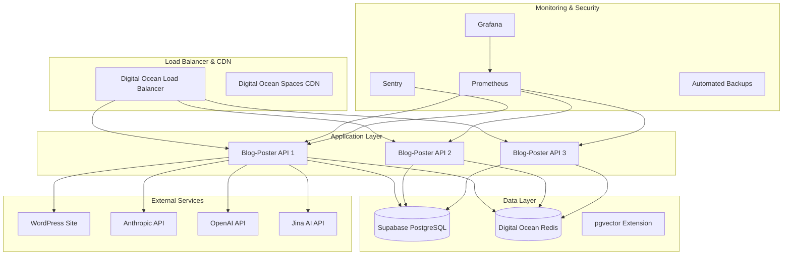

# Infrastructure Recommendations for Production Deployment

**Date**: August 13, 2025  
**Target**: Production-ready infrastructure for blog-poster  
**Platform**: Digital Ocean (primary) with multi-cloud considerations  
**Timeline**: 4-6 weeks implementation

## 🎯 Infrastructure Objectives

1. **Scalability**: Handle 100+ concurrent users and 500+ articles/month
2. **Reliability**: 99.9% uptime with automated failover
3. **Security**: Enterprise-grade security with compliance capabilities
4. **Cost Efficiency**: Optimize for development velocity and operational costs
5. **Observability**: Comprehensive monitoring and alerting

## 🏗️ Recommended Architecture

### Production Infrastructure Stack



### Infrastructure Components

| Component | Service | Configuration | Monthly Cost |
|-----------|---------|---------------|--------------|
| **Application** | DO App Platform | 3x $12 containers (512MB) | $36 |
| **Database** | Supabase Pro | PostgreSQL + pgvector | $25 |
| **Cache** | DO Managed Redis | 1GB cluster | $15 |
| **Load Balancer** | DO Load Balancer | SSL termination | $10 |
| **Storage** | DO Spaces | CDN + object storage | $5 |
| **Monitoring** | DO Monitoring + Sentry | Metrics + error tracking | $20 |
| **Backups** | Automated | Daily database backups | $10 |
| **Total** | | | **$121/month** |

## 📦 Digital Ocean App Platform Configuration

### Application Specification
```yaml
# app.yaml - Production deployment configuration
name: blog-poster-production
region: nyc
alerts:
- rule: CPU_UTILIZATION
  value: 80
- rule: MEM_UTILIZATION  
  value: 85
- rule: RESTART_COUNT
  value: 3

services:
- name: api
  source_dir: /
  github:
    repo: anthonyscolaro/blog-poster
    branch: main
    deploy_on_push: true
  run_command: uvicorn app:app --host 0.0.0.0 --port 8080
  http_port: 8080
  instance_count: 3
  instance_size_slug: basic-s  # 512MB RAM, 1 vCPU
  
  health_check:
    http_path: /health
    initial_delay_seconds: 30
    period_seconds: 10
    timeout_seconds: 5
    success_threshold: 2
    failure_threshold: 3
  
  # Environment variables from secrets
  envs:
  - key: DATABASE_URL
    scope: RUN_TIME
    value: ${db.DATABASE_URL}
  - key: REDIS_URL
    scope: RUN_TIME
    value: ${redis.REDIS_URL}
  - key: ANTHROPIC_API_KEY
    scope: RUN_TIME
    type: SECRET
  - key: OPENAI_API_KEY
    scope: RUN_TIME
    type: SECRET
  - key: JINA_API_KEY
    scope: RUN_TIME
    type: SECRET
  - key: WP_APP_PASSWORD
    scope: RUN_TIME
    type: SECRET
  - key: ENVIRONMENT
    scope: RUN_TIME
    value: "production"
  - key: LOG_LEVEL
    scope: RUN_TIME
    value: "INFO"
  - key: SENTRY_DSN
    scope: RUN_TIME
    type: SECRET

# Managed database services
databases:
- name: redis
  engine: REDIS
  production: true
  size: db-s-1vcpu-1gb
  version: "7"

# Static assets (if needed)
static_sites:
- name: admin-dashboard
  source_dir: /static
  github:
    repo: anthonyscolaro/blog-poster
    branch: main
  build_command: npm run build
  output_dir: dist
  routes:
  - path: /admin
```

### Auto-Scaling Configuration
```yaml
# Auto-scaling for high-traffic periods
services:
- name: api
  autoscaling:
    min_instance_count: 2
    max_instance_count: 8
    target_cpu_utilization: 70
    target_memory_utilization: 80
    scale_down_delay_seconds: 300
    scale_up_delay_seconds: 60
```

## 🗄️ Database & Storage Strategy

### Supabase Configuration (Recommended)
```sql
-- Production database configuration
-- Enable required extensions
CREATE EXTENSION IF NOT EXISTS "vector";
CREATE EXTENSION IF NOT EXISTS "pg_stat_statements";
CREATE EXTENSION IF NOT EXISTS "pg_cron";

-- Configure connection pooling
ALTER SYSTEM SET max_connections = 200;
ALTER SYSTEM SET shared_buffers = '256MB';
ALTER SYSTEM SET effective_cache_size = '1GB';
ALTER SYSTEM SET work_mem = '4MB';

-- Vector search optimization
ALTER SYSTEM SET shared_preload_libraries = 'vector';

-- Configure automated vacuuming for vector data
ALTER TABLE articles SET (
  autovacuum_enabled = true,
  autovacuum_vacuum_scale_factor = 0.1,
  autovacuum_analyze_scale_factor = 0.05
);
```

### Database Backup Strategy
```yaml
# Automated backup configuration
backup_schedule:
  full_backup: "0 2 * * *"  # Daily at 2 AM
  incremental_backup: "0 */6 * * *"  # Every 6 hours
  retention_policy: "30 days"
  
backup_verification:
  test_restore: "weekly"
  backup_integrity_check: "daily"
  
disaster_recovery:
  rto: "4 hours"  # Recovery Time Objective
  rpo: "1 hour"   # Recovery Point Objective
```

### Redis Configuration
```yaml
# Digital Ocean Managed Redis configuration
redis_config:
  memory_policy: "allkeys-lru"
  max_memory: "1gb"
  persistence: "rdb_and_aof"
  backup_schedule: "daily"
  
cache_strategy:
  api_responses: "ttl: 300s"
  search_results: "ttl: 3600s"
  user_sessions: "ttl: 86400s"
  rate_limiting: "ttl: 60s"
```

## 🔐 Security Infrastructure

### SSL/TLS Configuration
```yaml
# Digital Ocean Load Balancer SSL configuration
ssl_config:
  certificate_type: "lets_encrypt"
  redirect_http_to_https: true
  tls_version: "1.2_and_1.3"
  cipher_suites: "modern"
  
security_headers:
  - "Strict-Transport-Security: max-age=31536000; includeSubDomains"
  - "X-Content-Type-Options: nosniff"
  - "X-Frame-Options: DENY"
  - "X-XSS-Protection: 1; mode=block"
  - "Content-Security-Policy: default-src 'self'"
```

### Secrets Management
```bash
#!/bin/bash
# setup-production-secrets.sh

# Set up Digital Ocean secrets
doctl apps create-deployment $APP_ID \
  --wait \
  --env-type SECRET \
  ANTHROPIC_API_KEY="$PROD_ANTHROPIC_KEY" \
  OPENAI_API_KEY="$PROD_OPENAI_KEY" \
  JINA_API_KEY="$PROD_JINA_KEY" \
  WP_APP_PASSWORD="$PROD_WP_PASSWORD" \
  SENTRY_DSN="$PROD_SENTRY_DSN" \
  JWT_SECRET="$PROD_JWT_SECRET"

echo "✅ Production secrets configured"
```

### Network Security
```yaml
# Virtual Private Cloud configuration
vpc_config:
  cidr_block: "10.0.0.0/16"
  
security_groups:
  api_servers:
    ingress:
    - port: 443
      protocol: tcp
      source: "0.0.0.0/0"
    - port: 80
      protocol: tcp
      source: "0.0.0.0/0"
    egress:
    - port: 443
      protocol: tcp
      destination: "0.0.0.0/0"
  
  database:
    ingress:
    - port: 5432
      protocol: tcp
      source: "api_servers_sg"
    egress: []
```

## 📊 Monitoring & Observability

### Prometheus Configuration
```yaml
# prometheus.yml
global:
  scrape_interval: 15s
  
scrape_configs:
- job_name: 'blog-poster-api'
  static_configs:
  - targets: ['api:8080']
  metrics_path: '/metrics'
  scrape_interval: 5s

- job_name: 'postgres'
  static_configs:
  - targets: ['postgres-exporter:9187']

- job_name: 'redis'
  static_configs:
  - targets: ['redis-exporter:9121']

rule_files:
- "alert_rules.yml"

alerting:
  alertmanagers:
  - static_configs:
    - targets:
      - alertmanager:9093
```

### Application Metrics
```python
# src/core/metrics.py
from prometheus_client import Counter, Histogram, Gauge
import time
from functools import wraps

# Application metrics
ARTICLE_GENERATION_COUNTER = Counter(
    'articles_generated_total',
    'Total number of articles generated',
    ['agent', 'status']
)

ARTICLE_GENERATION_DURATION = Histogram(
    'article_generation_duration_seconds',
    'Time spent generating articles',
    ['agent']
)

API_REQUEST_DURATION = Histogram(
    'api_request_duration_seconds',
    'API request duration',
    ['method', 'endpoint', 'status']
)

ACTIVE_PIPELINES = Gauge(
    'active_pipelines',
    'Number of active pipelines'
)

LLM_API_COSTS = Counter(
    'llm_api_costs_total',
    'Total LLM API costs',
    ['provider', 'model']
)

def track_api_metrics(func):
    """Decorator to track API endpoint metrics"""
    @wraps(func)
    async def wrapper(*args, **kwargs):
        start_time = time.time()
        status = "success"
        
        try:
            result = await func(*args, **kwargs)
            return result
        except Exception as e:
            status = "error"
            raise
        finally:
            duration = time.time() - start_time
            API_REQUEST_DURATION.labels(
                method=kwargs.get('method', 'unknown'),
                endpoint=kwargs.get('endpoint', 'unknown'),
                status=status
            ).observe(duration)
    
    return wrapper

def track_article_generation(agent_name: str):
    """Decorator to track article generation metrics"""
    def decorator(func):
        @wraps(func)
        async def wrapper(*args, **kwargs):
            start_time = time.time()
            status = "success"
            
            try:
                result = await func(*args, **kwargs)
                return result
            except Exception as e:
                status = "error"
                raise
            finally:
                duration = time.time() - start_time
                ARTICLE_GENERATION_COUNTER.labels(
                    agent=agent_name,
                    status=status
                ).inc()
                ARTICLE_GENERATION_DURATION.labels(
                    agent=agent_name
                ).observe(duration)
        
        return wrapper
    return decorator
```

### Grafana Dashboards
```json
// grafana-dashboard.json
{
  "dashboard": {
    "title": "Blog-Poster Production Dashboard",
    "panels": [
      {
        "title": "API Request Rate",
        "type": "graph",
        "targets": [
          {
            "expr": "rate(api_request_duration_seconds_count[5m])",
            "legendFormat": "{{endpoint}}"
          }
        ]
      },
      {
        "title": "Article Generation Rate",
        "type": "singlestat",
        "targets": [
          {
            "expr": "rate(articles_generated_total[1h])",
            "legendFormat": "Articles/hour"
          }
        ]
      },
      {
        "title": "LLM API Costs",
        "type": "graph",
        "targets": [
          {
            "expr": "increase(llm_api_costs_total[24h])",
            "legendFormat": "{{provider}}"
          }
        ]
      },
      {
        "title": "Error Rate",
        "type": "graph",
        "targets": [
          {
            "expr": "rate(api_request_duration_seconds_count{status=\"error\"}[5m]) / rate(api_request_duration_seconds_count[5m])",
            "legendFormat": "Error Rate"
          }
        ]
      }
    ]
  }
}
```

### Alert Rules
```yaml
# alert_rules.yml
groups:
- name: blog-poster-alerts
  rules:
  - alert: HighErrorRate
    expr: rate(api_request_duration_seconds_count{status="error"}[5m]) / rate(api_request_duration_seconds_count[5m]) > 0.05
    for: 2m
    labels:
      severity: warning
    annotations:
      summary: "High error rate detected"
      description: "Error rate is {{ $value | humanizePercentage }} for the last 5 minutes"

  - alert: HighAPILatency
    expr: histogram_quantile(0.95, rate(api_request_duration_seconds_bucket[5m])) > 2
    for: 5m
    labels:
      severity: warning
    annotations:
      summary: "High API latency detected"
      description: "95th percentile latency is {{ $value }}s"

  - alert: DatabaseConnectionsHigh
    expr: pg_stat_activity_count > 180
    for: 2m
    labels:
      severity: warning
    annotations:
      summary: "Database connections high"
      description: "{{ $value }} active database connections"

  - alert: LLMCostsHigh
    expr: increase(llm_api_costs_total[1h]) > 10
    for: 0m
    labels:
      severity: critical
    annotations:
      summary: "LLM costs are unusually high"
      description: "LLM costs have increased by ${{ $value }} in the last hour"
```

## 🚀 Deployment Pipeline

### CI/CD Configuration
```yaml
# .github/workflows/production-deploy.yml
name: Production Deployment

on:
  push:
    branches: [main]
    tags: ['v*']

env:
  DO_APP_ID: ${{ secrets.DO_PRODUCTION_APP_ID }}

jobs:
  test:
    runs-on: ubuntu-latest
    steps:
    - uses: actions/checkout@v3
    - name: Set up Python
      uses: actions/setup-python@v4
      with:
        python-version: '3.11'
    
    - name: Install dependencies
      run: |
        pip install -r requirements.txt
        pip install -r requirements-test.txt
    
    - name: Run comprehensive tests
      run: |
        python -m pytest tests/ --cov=src --cov-fail-under=85
    
    - name: Security scan
      run: |
        bandit -r src/
        safety check

  deploy:
    needs: test
    runs-on: ubuntu-latest
    if: github.ref == 'refs/heads/main'
    
    steps:
    - uses: actions/checkout@v3
    
    - name: Install doctl
      uses: digitalocean/action-doctl@v2
      with:
        token: ${{ secrets.DIGITALOCEAN_ACCESS_TOKEN }}
    
    - name: Deploy to Digital Ocean
      run: |
        doctl apps create-deployment $DO_APP_ID --wait
        
    - name: Verify deployment
      run: |
        # Wait for deployment to be ready
        sleep 60
        
        # Health check
        curl -f https://api.servicedogus.com/health
        
        # Basic functionality test
        curl -f https://api.servicedogus.com/metrics
    
    - name: Notify team
      if: always()
      uses: 8398a7/action-slack@v3
      with:
        status: ${{ job.status }}
        text: "Production deployment ${{ job.status }}"
      env:
        SLACK_WEBHOOK_URL: ${{ secrets.SLACK_WEBHOOK }}
```

### Blue-Green Deployment Strategy
```bash
#!/bin/bash
# blue-green-deploy.sh

echo "🚀 Starting blue-green deployment..."

# Get current active deployment
CURRENT_APP=$(doctl apps list --format Name,LiveURL | grep blog-poster-production | awk '{print $1}')
echo "Current active app: $CURRENT_APP"

# Determine next environment
if [[ $CURRENT_APP == *"blue"* ]]; then
    NEW_ENV="green"
    OLD_ENV="blue"
else
    NEW_ENV="blue" 
    OLD_ENV="green"
fi

echo "Deploying to: $NEW_ENV environment"

# Deploy to new environment
doctl apps create-deployment blog-poster-$NEW_ENV --wait

# Health check new deployment
NEW_URL=$(doctl apps get blog-poster-$NEW_ENV --format LiveURL --no-header)
echo "Testing new deployment at: $NEW_URL"

# Run health checks
python scripts/health-check.py --url $NEW_URL

if [ $? -eq 0 ]; then
    echo "✅ Health checks passed"
    
    # Switch traffic to new environment
    echo "🔄 Switching traffic to $NEW_ENV"
    # Update load balancer configuration
    # Update DNS records if needed
    
    echo "✅ Deployment complete"
    
    # Keep old environment for rollback
    echo "ℹ️  Old environment ($OLD_ENV) kept for rollback"
    
else
    echo "❌ Health checks failed"
    echo "🔄 Rolling back deployment"
    
    # Cleanup failed deployment
    doctl apps delete blog-poster-$NEW_ENV --force
    
    exit 1
fi
```

## 💰 Cost Optimization

### Resource Optimization
```yaml
# Resource allocation optimization
optimization_strategies:
  auto_scaling:
    scale_down_threshold: "cpu < 30% AND memory < 50%"
    scale_down_delay: "10 minutes"
    min_instances: 2
    
  database_optimization:
    connection_pooling: true
    query_caching: true
    automated_vacuum: true
    
  api_optimization:
    response_caching: "300 seconds"
    gzip_compression: true
    cdn_static_assets: true
```

### Cost Monitoring
```python
# src/core/cost_tracking.py
import os
from datetime import datetime, timedelta
from typing import Dict, List

class CostMonitor:
    """Monitor and alert on infrastructure costs"""
    
    def __init__(self):
        self.monthly_budget = float(os.getenv("MONTHLY_BUDGET", 200))
        self.cost_alert_threshold = 0.8  # 80% of budget
        
    async def check_monthly_costs(self) -> Dict[str, float]:
        """Check current month costs across all services"""
        costs = {
            "digital_ocean": await self._get_do_costs(),
            "supabase": await self._get_supabase_costs(),
            "llm_apis": await self._get_llm_costs(),
            "monitoring": await self._get_monitoring_costs()
        }
        
        total_cost = sum(costs.values())
        
        if total_cost > (self.monthly_budget * self.cost_alert_threshold):
            await self._send_cost_alert(total_cost, costs)
            
        return costs
    
    async def _send_cost_alert(self, total_cost: float, breakdown: Dict[str, float]):
        """Send cost alert to team"""
        message = f"""
🚨 **Cost Alert**: Monthly spending at {total_cost/self.monthly_budget*100:.1f}% of budget

**Breakdown**:
- Digital Ocean: ${breakdown['digital_ocean']:.2f}
- Supabase: ${breakdown['supabase']:.2f}  
- LLM APIs: ${breakdown['llm_apis']:.2f}
- Monitoring: ${breakdown['monitoring']:.2f}

**Total**: ${total_cost:.2f} / ${self.monthly_budget:.2f}
        """
        
        # Send to Slack/email
        await self._send_notification(message)
```

## 🔄 Disaster Recovery

### Backup Strategy
```yaml
# Comprehensive backup strategy
backup_plan:
  database_backups:
    frequency: "every 6 hours"
    retention: "30 days"
    verification: "daily restore test"
    
  application_backups:
    git_repository: "primary source"
    docker_images: "stored in registry"
    configuration: "Infrastructure as Code"
    
  data_backups:
    user_generated_content: "daily to DO Spaces"
    cached_data: "redis persistence"
    logs: "30 day retention"

recovery_procedures:
  rto: "4 hours"  # Recovery Time Objective
  rpo: "1 hour"   # Recovery Point Objective
  
  failover_steps:
    1. "Assess incident severity"
    2. "Activate backup systems"
    3. "Restore from latest backup"
    4. "Verify system functionality"
    5. "Update DNS/load balancer"
    6. "Monitor system health"
```

### Incident Response
```python
# scripts/incident-response.py
import asyncio
import logging
from enum import Enum

class IncidentSeverity(Enum):
    LOW = "low"
    MEDIUM = "medium" 
    HIGH = "high"
    CRITICAL = "critical"

class IncidentResponse:
    """Automated incident response system"""
    
    async def handle_incident(self, severity: IncidentSeverity, description: str):
        """Handle incident based on severity"""
        
        if severity == IncidentSeverity.CRITICAL:
            await self._critical_incident_response(description)
        elif severity == IncidentSeverity.HIGH:
            await self._high_incident_response(description)
        else:
            await self._standard_incident_response(description)
    
    async def _critical_incident_response(self, description: str):
        """Critical incident - immediate action required"""
        # 1. Alert on-call engineer immediately
        await self._page_oncall_engineer(description)
        
        # 2. Create incident war room
        await self._create_incident_channel(description)
        
        # 3. Enable maintenance mode if needed
        await self._enable_maintenance_mode()
        
        # 4. Start automated diagnostics
        await self._run_system_diagnostics()
        
        # 5. Prepare rollback if needed
        await self._prepare_emergency_rollback()
```

## 📋 Implementation Checklist

### Week 1: Infrastructure Setup
- [ ] Set up Digital Ocean App Platform
- [ ] Configure Supabase production database
- [ ] Set up managed Redis cluster
- [ ] Configure load balancer and SSL
- [ ] Set up monitoring infrastructure

### Week 2: Security & Secrets
- [ ] Implement secrets management
- [ ] Configure security headers
- [ ] Set up SSL certificates
- [ ] Implement authentication
- [ ] Configure rate limiting

### Week 3: Monitoring & Alerting
- [ ] Deploy Prometheus monitoring
- [ ] Configure Grafana dashboards
- [ ] Set up Sentry error tracking
- [ ] Configure alert rules
- [ ] Test incident response

### Week 4: Optimization & Testing
- [ ] Performance optimization
- [ ] Cost monitoring implementation
- [ ] Load testing
- [ ] Disaster recovery testing
- [ ] Documentation completion

## 🎯 Success Metrics

### Performance Targets
- **Response Time**: <500ms (95th percentile)
- **Throughput**: 1000+ requests/minute
- **Uptime**: 99.9% availability
- **Scalability**: Auto-scale 2-8 instances

### Cost Targets
- **Monthly Infrastructure**: <$150
- **Cost per Article**: <$0.30
- **LLM API Efficiency**: <$0.15 per article
- **Total Cost per User**: <$2.00/month

### Reliability Targets
- **Error Rate**: <0.1%
- **MTTR**: <30 minutes
- **MTBF**: >720 hours
- **Data Loss**: Zero tolerance

---

**This infrastructure recommendation provides a production-ready, scalable, and cost-effective deployment strategy for the blog-poster application. The architecture balances performance, reliability, and operational simplicity while maintaining cost efficiency.**