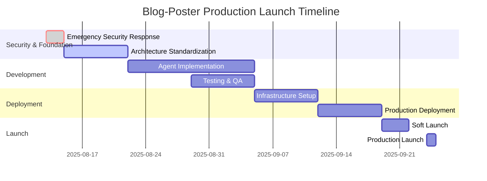

# Production Launch Plan

**Date**: August 13, 2025  
**Target Launch**: September 24, 2025 (6 weeks)  
**Project**: Blog-Poster Production Deployment  
**Status**: Pre-Launch Development Phase

## 🎯 Launch Objectives

1. **Secure Production Release**: Zero security vulnerabilities
2. **Reliable Operation**: 99.9% uptime with automated monitoring
3. **Quality Content**: 85%+ SEO score on generated articles
4. **Cost Efficiency**: <$0.50 per article generation
5. **Legal Compliance**: 100% ADA compliance verification

## 📅 6-Week Launch Timeline



## 🗓️ Detailed Weekly Breakdown

### Week 1 (Aug 13-20): Security & Architecture Foundation
**Theme**: Emergency Remediation & Standardization  
**Lead**: Security/DevOps Team  
**Status**: 🚨 CRITICAL

#### Days 1-2: Emergency Security Response
**Objectives**: Eliminate security vulnerabilities immediately
- [x] Revoke all exposed API credentials
- [x] Clean git history of sensitive data
- [x] Implement emergency access controls
- [x] Fix CORS configuration
- [x] Update documentation

**Deliverables**:
- [ ] All API keys revoked and regenerated
- [ ] Git history cleaned
- [ ] Emergency authentication implemented
- [ ] Secure CORS configuration
- [ ] Updated README.md

#### Days 3-7: Architecture Standardization
**Objectives**: Achieve environment parity and consistent infrastructure
- [ ] Standardize on Supabase-centric architecture
- [ ] Migrate staging to standardized configuration
- [ ] Update database schemas for consistency
- [ ] Implement unified configuration management
- [ ] Validate environment parity

**Deliverables**:
- [ ] Standardized docker-compose configurations
- [ ] Unified database schema
- [ ] Environment parity testing
- [ ] Configuration management system
- [ ] Migration scripts and procedures

### Week 2 (Aug 21-27): Agent Implementation Completion
**Theme**: Complete Missing Agent Functionality  
**Lead**: AI/Backend Development Team  
**Status**: 🔧 Development

#### Legal Fact Checker Agent (Days 1-3)
**Priority**: CRITICAL for legal compliance
```python
# Implementation milestones
class LegalFactCheckerMilestones:
    day_1_tasks = [
        "Research ADA regulation database",
        "Design compliance verification algorithms",
        "Create misconception detection system"
    ]
    
    day_2_tasks = [
        "Implement citation verification",
        "Build compliance scoring system", 
        "Add disclaimer generation"
    ]
    
    day_3_tasks = [
        "Create comprehensive test suite",
        "Validate against known ADA violations",
        "Integration testing with article generation"
    ]
```

#### Competitor Monitoring Agent (Days 4-7)
**Priority**: HIGH for market intelligence
```python
# Implementation milestones
class CompetitorMonitoringMilestones:
    day_4_tasks = [
        "Integrate Jina AI for content scraping",
        "Implement competitor discovery algorithms",
        "Build content analysis pipeline"
    ]
    
    day_5_tasks = [
        "Add content quality assessment",
        "Implement topic gap identification",
        "Create competitive intelligence reporting"
    ]
    
    day_6_7_tasks = [
        "Build automated monitoring schedules",
        "Add change detection algorithms",
        "Create comprehensive test suite"
    ]
```

#### Topic Analysis Enhancement (Parallel)
**Priority**: MEDIUM for accuracy improvement
- [ ] Replace mock data with real API integrations
- [ ] Add Google Keyword Planner API
- [ ] Implement Google Trends analysis
- [ ] Enhance algorithm validation

**Deliverables**:
- [ ] Fully functional Legal Fact Checker Agent
- [ ] Complete Competitor Monitoring Agent
- [ ] Enhanced Topic Analysis with real data
- [ ] All agents passing comprehensive tests
- [ ] Agent integration workflows validated

### Week 3 (Aug 28 - Sep 3): Testing & Quality Assurance
**Theme**: Comprehensive Testing for Production Confidence  
**Lead**: QA/Testing Team  
**Status**: 🧪 Testing

#### Testing Implementation (Days 1-4)
**Unit Testing**:
- [ ] Agent logic testing (90%+ coverage)
- [ ] Database model testing
- [ ] API endpoint testing
- [ ] Error handling validation

**Integration Testing**:
- [ ] Multi-agent workflow testing
- [ ] External service integration testing
- [ ] Database transaction testing
- [ ] WordPress publishing validation

**Security Testing**:
- [ ] Authentication bypass testing
- [ ] Input validation testing
- [ ] SQL injection prevention
- [ ] Rate limiting validation

#### Performance & Load Testing (Days 5-7)
**Performance Benchmarks**:
- [ ] API response time: <500ms (95th percentile)
- [ ] Article generation time: <2 minutes
- [ ] Concurrent user capacity: 50+ users
- [ ] Database query performance: <500ms

**Load Testing Scenarios**:
```python
# Load testing scenarios
load_test_scenarios = [
    {
        "name": "Normal Load",
        "concurrent_users": 10,
        "duration": "30 minutes",
        "success_criteria": "0% error rate"
    },
    {
        "name": "Peak Load", 
        "concurrent_users": 50,
        "duration": "15 minutes",
        "success_criteria": "<1% error rate"
    },
    {
        "name": "Stress Test",
        "concurrent_users": 100,
        "duration": "10 minutes", 
        "success_criteria": "Graceful degradation"
    }
]
```

**Deliverables**:
- [ ] 85%+ test coverage achieved
- [ ] All performance benchmarks met
- [ ] Load testing scenarios passed
- [ ] Security testing complete
- [ ] Test automation pipeline implemented

### Week 4 (Sep 4-10): Infrastructure & Deployment Setup
**Theme**: Production Infrastructure Deployment  
**Lead**: DevOps/Infrastructure Team  
**Status**: 🏗️ Infrastructure

#### Production Infrastructure (Days 1-3)
**Digital Ocean Setup**:
- [ ] App Platform configuration
- [ ] Managed database setup (Supabase)
- [ ] Redis cluster configuration
- [ ] Load balancer setup
- [ ] SSL certificate configuration

**Monitoring & Observability**:
- [ ] Prometheus deployment
- [ ] Grafana dashboard configuration
- [ ] Sentry error tracking
- [ ] Alert rule implementation
- [ ] Log aggregation setup

#### CI/CD Pipeline (Days 4-5)
**Deployment Automation**:
```yaml
# CI/CD pipeline stages
pipeline_stages:
  - name: "Test"
    tasks: ["unit_tests", "integration_tests", "security_scan"]
  - name: "Build"
    tasks: ["docker_build", "image_scan", "registry_push"]
  - name: "Deploy_Staging"
    tasks: ["deploy_staging", "smoke_tests", "integration_validation"]
  - name: "Deploy_Production"
    tasks: ["blue_green_deploy", "health_check", "rollback_ready"]
```

#### Security Hardening (Days 6-7)
**Production Security**:
- [ ] Secrets management implementation
- [ ] Network security configuration
- [ ] Database security hardening
- [ ] Application security headers
- [ ] Penetration testing

**Deliverables**:
- [ ] Production infrastructure deployed
- [ ] Monitoring and alerting operational
- [ ] CI/CD pipeline automated
- [ ] Security hardening complete
- [ ] Infrastructure documentation

### Week 5 (Sep 11-17): Pre-Production Validation
**Theme**: Final Validation & Staging Deployment  
**Lead**: Full Team  
**Status**: 🔍 Validation

#### Staging Environment Testing (Days 1-3)
**End-to-End Validation**:
- [ ] Complete article generation workflow
- [ ] Multi-agent coordination testing
- [ ] WordPress publishing validation
- [ ] Cost tracking verification
- [ ] Performance under realistic load

**Data Migration Testing**:
- [ ] Production data migration procedures
- [ ] Backup and restore validation
- [ ] Database migration scripts
- [ ] Data integrity verification

#### User Acceptance Testing (Days 4-5)
**Business Validation**:
- [ ] Content quality assessment
- [ ] SEO compliance verification
- [ ] Legal compliance validation
- [ ] User interface testing
- [ ] Business workflow validation

#### Production Readiness Review (Days 6-7)
**Go/No-Go Assessment**:
```python
# Production readiness checklist
production_readiness = {
    "security": {
        "vulnerabilities_resolved": True,
        "penetration_testing_passed": True,
        "compliance_verified": True
    },
    "performance": {
        "load_testing_passed": True,
        "response_times_acceptable": True,
        "scalability_validated": True
    },
    "reliability": {
        "uptime_target_met": True,
        "monitoring_operational": True,
        "incident_response_ready": True
    },
    "business": {
        "content_quality_validated": True,
        "cost_targets_met": True,
        "legal_compliance_verified": True
    }
}
```

**Deliverables**:
- [ ] Staging environment fully validated
- [ ] User acceptance testing complete
- [ ] Production readiness review passed
- [ ] Go/No-Go decision documented
- [ ] Launch procedures finalized

### Week 6 (Sep 18-24): Production Launch
**Theme**: Controlled Production Release  
**Lead**: Release Management Team  
**Status**: 🚀 Launch

#### Soft Launch (Days 1-3)
**Limited Production Release**:
- [ ] Deploy to production infrastructure
- [ ] Enable limited feature set
- [ ] Monitor with reduced traffic
- [ ] Validate core functionality
- [ ] Collect performance metrics

**Monitoring & Validation**:
```python
# Soft launch monitoring
soft_launch_metrics = {
    "traffic_limit": "10% of expected load",
    "feature_scope": "Core article generation only",
    "monitoring_frequency": "Real-time",
    "rollback_criteria": [
        "Error rate > 1%",
        "Response time > 2 seconds",
        "Any security incident"
    ]
}
```

#### Full Production Launch (Days 4-5)
**Complete Feature Release**:
- [ ] Enable all production features
- [ ] Scale to full capacity
- [ ] Monitor all business metrics
- [ ] Validate automated processes
- [ ] Confirm cost tracking

#### Post-Launch Monitoring (Days 6-7)
**Operational Validation**:
- [ ] 48-hour continuous monitoring
- [ ] Performance baseline establishment
- [ ] Cost tracking validation
- [ ] User feedback collection
- [ ] Issue triage and resolution

**Deliverables**:
- [ ] Production system fully operational
- [ ] All features validated in production
- [ ] Performance baselines established
- [ ] Monitoring and alerting confirmed
- [ ] Post-launch report completed

## 📊 Success Metrics & KPIs

### Technical Metrics
```yaml
technical_kpis:
  performance:
    api_response_time: "<500ms (95th percentile)"
    article_generation_time: "<2 minutes"
    system_uptime: ">99.9%"
    error_rate: "<0.1%"
    
  scalability:
    concurrent_users: ">50"
    articles_per_hour: ">10"
    database_performance: "<500ms queries"
    auto_scaling_response: "<2 minutes"
    
  security:
    vulnerability_count: "0"
    security_incidents: "0"
    compliance_score: "100%"
    penetration_test_score: ">95%"
```

### Business Metrics
```yaml
business_kpis:
  content_quality:
    seo_score_average: ">85%"
    word_count_compliance: ">95%"
    legal_compliance_rate: "100%"
    content_uniqueness: ">90%"
    
  cost_efficiency:
    cost_per_article: "<$0.50"
    monthly_infrastructure_cost: "<$150"
    llm_api_efficiency: "<$0.15 per article"
    cost_prediction_accuracy: ">90%"
    
  operational:
    deployment_success_rate: "100%"
    incident_response_time: "<30 minutes"
    backup_success_rate: "100%"
    monitoring_coverage: "100%"
```

### Quality Gates
```python
# Quality gates for each phase
class QualityGates:
    week_1_gates = {
        "security_vulnerabilities": 0,
        "architecture_consistency": "100%",
        "environment_parity": "100%"
    }
    
    week_2_gates = {
        "agent_implementation": "100%",
        "agent_test_coverage": ">90%",
        "integration_success": "100%"
    }
    
    week_3_gates = {
        "test_coverage": ">85%",
        "performance_benchmarks": "100% met",
        "security_testing": "All passed"
    }
    
    week_4_gates = {
        "infrastructure_uptime": ">99.9%",
        "monitoring_operational": "100%",
        "deployment_automation": "100%"
    }
    
    week_5_gates = {
        "staging_validation": "100%",
        "user_acceptance": "All passed",
        "production_readiness": "Go decision"
    }
    
    week_6_gates = {
        "production_deployment": "Success",
        "feature_validation": "100%",
        "performance_baselines": "Established"
    }
```

## 🚨 Risk Management

### High-Risk Areas
```yaml
risk_assessment:
  critical_risks:
    - name: "Security vulnerabilities in production"
      probability: "Low (with remediation)"
      impact: "Critical"
      mitigation: "Comprehensive security testing + penetration testing"
      
    - name: "Agent implementation delays"
      probability: "Medium"
      impact: "High"
      mitigation: "Parallel development + agile sprints"
      
    - name: "Performance issues under load"
      probability: "Medium"
      impact: "High"
      mitigation: "Extensive load testing + auto-scaling"
      
    - name: "Integration failures"
      probability: "Low"
      impact: "Medium"
      mitigation: "Comprehensive integration testing"

  contingency_plans:
    security_incident:
      response_time: "<1 hour"
      escalation: "Immediate security team alert"
      communication: "Stakeholder notification within 2 hours"
      
    performance_degradation:
      detection: "Automated monitoring alerts"
      response: "Auto-scaling + performance investigation"
      rollback: "Automated rollback if critical"
      
    agent_failures:
      detection: "Health check monitoring"
      response: "Graceful degradation to manual mode"
      recovery: "Agent restart + error analysis"
```

### Go/No-Go Criteria
```yaml
launch_decision_criteria:
  go_criteria:
    security:
      - "Zero critical vulnerabilities"
      - "Penetration testing passed"
      - "Compliance verification complete"
    
    performance:
      - "All performance benchmarks met"
      - "Load testing successful"
      - "Auto-scaling validated"
    
    functionality:
      - "All core features operational"
      - "Agent integration successful"
      - "WordPress publishing verified"
    
    operational:
      - "Monitoring and alerting operational"
      - "Backup and recovery tested"
      - "Incident response procedures ready"

  no_go_criteria:
    - "Any critical security vulnerability"
    - "Performance benchmarks not met"
    - "Core functionality failures"
    - "Monitoring not operational"
    - "Backup/recovery failures"
```

## 📋 Pre-Launch Checklist

### Technical Readiness
- [ ] **Security**: All vulnerabilities resolved, penetration testing passed
- [ ] **Performance**: Load testing completed, benchmarks met
- [ ] **Functionality**: All features tested, integrations validated
- [ ] **Infrastructure**: Production environment deployed, monitoring operational
- [ ] **Documentation**: Operational procedures documented, runbooks created

### Business Readiness
- [ ] **Content Quality**: SEO compliance verified, legal accuracy validated
- [ ] **Cost Management**: Budget tracking operational, cost alerts configured
- [ ] **User Experience**: Interface tested, workflows validated
- [ ] **Support**: Help documentation created, support procedures established
- [ ] **Marketing**: Launch communication prepared, user onboarding ready

### Operational Readiness
- [ ] **Team Training**: Operations team trained, procedures documented
- [ ] **Incident Response**: Response procedures tested, escalation paths confirmed
- [ ] **Monitoring**: All systems monitored, alerts configured
- [ ] **Backup**: Backup procedures tested, recovery validated
- [ ] **Compliance**: Legal requirements met, audit trail established

## 🔗 Dependencies & Integrations

### External Service Dependencies
```yaml
external_dependencies:
  anthropic_api:
    status: "Ready"
    backup: "OpenAI API"
    testing_required: "Load testing with new keys"
    
  openai_api:
    status: "Ready" 
    backup: "Anthropic Claude"
    testing_required: "Failover testing"
    
  wordpress_site:
    status: "Ready"
    backup: "Manual publishing"
    testing_required: "Publishing automation"
    
  jina_ai:
    status: "Integration required"
    backup: "Manual competitor analysis"
    testing_required: "Scraping reliability"
    
  supabase:
    status: "Ready"
    backup: "Database migration procedures"
    testing_required: "Performance under load"
```

### Internal Dependencies
```yaml
internal_dependencies:
  agent_implementations:
    topic_analysis: "85% complete"
    article_generation: "95% complete"
    competitor_monitoring: "30% complete"
    legal_fact_checker: "15% complete"
    wordpress_publisher: "90% complete"
    
  infrastructure_components:
    database_migration: "Required"
    secrets_management: "Required"
    monitoring_setup: "Required"
    ci_cd_pipeline: "Required"
    
  testing_infrastructure:
    unit_test_suite: "40% complete"
    integration_tests: "20% complete"
    performance_tests: "10% complete"
    security_tests: "5% complete"
```

## 📞 Communication Plan

### Stakeholder Updates
```yaml
communication_schedule:
  daily_standups:
    time: "9:00 AM"
    participants: "Development team"
    duration: "15 minutes"
    
  weekly_status:
    day: "Friday"
    participants: "All stakeholders"
    format: "Written report + demo"
    
  milestone_reviews:
    frequency: "End of each week"
    participants: "Leadership + team leads"
    format: "Formal review meeting"
    
  launch_updates:
    frequency: "Twice daily during launch week"
    participants: "All stakeholders"
    format: "Slack updates + metrics dashboard"
```

### Launch Communication
```yaml
launch_communication:
  internal_announcement:
    timing: "1 day before launch"
    audience: "All company stakeholders"
    format: "Email + Slack announcement"
    
  external_communication:
    timing: "After successful launch validation"
    audience: "Users and customers"
    format: "Blog post + email newsletter"
    
  press_release:
    timing: "1 week after successful launch"
    audience: "Industry publications"
    format: "Formal press release"
```

---

**This production launch plan provides a comprehensive 6-week roadmap from current state to production-ready deployment. Success depends on rigorous execution of security remediation, agent completion, comprehensive testing, and careful production rollout.**