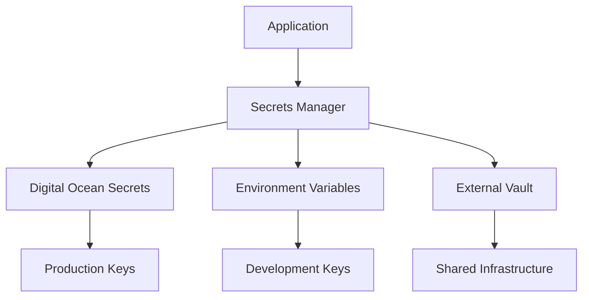

# Secrets Management Plan

**Project**: Blog-Poster  
**Date**: August 13, 2025  
**Priority**: CRITICAL (P0)  
**Timeline**: Implement within 48 hours

## 🎯 Objective

Establish a secure, scalable secrets management system that eliminates hardcoded credentials and provides automated rotation, audit trails, and environment isolation.

## 🚨 Current State Analysis

### Critical Issues
1. **Exposed Production Credentials**: Live API keys committed to git
2. **No Environment Separation**: Same credentials across dev/staging/prod
3. **Manual Key Management**: No rotation or lifecycle management
4. **Audit Trail Gap**: No tracking of credential access or usage

### Financial Risk Assessment
| Service | Monthly Exposure | Abuse Potential | Revocation Complexity |
|---------|------------------|-----------------|----------------------|
| Anthropic Claude | $2,000+ | High | Medium |
| OpenAI | $1,500+ | High | Medium |
| Supabase | $500+ | Critical (data) | High |
| WordPress | $0 | High (reputation) | Low |
| Jina AI | $300+ | Medium | Low |

## 🏗️ Target Architecture

### Three-Tier Secrets Management



### Environment Strategy
```
├── Development
│   ├── Local .env files (gitignored)
│   ├── Placeholder/demo keys
│   └── Limited-scope test credentials
├── Staging
│   ├── Digital Ocean App Secrets
│   ├── Staging-specific credentials
│   └── Production-like but isolated
└── Production
    ├── Digital Ocean App Secrets
    ├── Full-capability credentials
    └── Automated rotation enabled
```

## 🔧 Implementation Plan

### Phase 1: Emergency Remediation (0-24 hours)

#### 1.1 Immediate Credential Revocation
```bash
#!/bin/bash
# emergency-key-rotation.sh

echo "🚨 EMERGENCY: Revoking exposed credentials..."

# Anthropic
echo "1. Revoking Anthropic API key..."
echo "   → Login to https://console.anthropic.com"
echo "   → Navigate to API Keys"
echo "   → Delete key: sk-ant-api03-hPGHI..."
echo "   → Generate new key with name: blog-poster-prod-$(date +%Y%m%d)"

# OpenAI
echo "2. Revoking OpenAI API key..."
echo "   → Login to https://platform.openai.com"
echo "   → Navigate to API Keys"
echo "   → Delete exposed key"
echo "   → Generate new key: blog-poster-prod-$(date +%Y%m%d)"

# Supabase
echo "3. Resetting Supabase credentials..."
echo "   → Login to https://supabase.com/dashboard"
echo "   → Project fwrfexwmfrpavcpyivpw > Settings > API"
echo "   → Reset service_role key"
echo "   → Note new key for secure storage"

# WordPress
echo "4. WordPress application password..."
echo "   → Login to staging-wp.servicedogus.org/wp-admin"
echo "   → Users > anthony > Application Passwords"
echo "   → Revoke existing password"
echo "   → Generate new: blog-poster-app-$(date +%Y%m%d)"

echo "✅ All credentials revoked. Proceed to secure storage setup."
```

#### 1.2 Git History Cleanup
```bash
#!/bin/bash
# clean-git-history.sh

echo "🧹 Cleaning git history of exposed credentials..."

# Backup current branch
git branch backup-before-cleanup

# Remove .env.staging from all history
git filter-branch --force --index-filter \
  'git rm --cached --ignore-unmatch .env.staging' \
  --prune-empty --tag-name-filter cat -- --all

# Remove any other potential credential files
git filter-branch --force --index-filter \
  'git rm --cached --ignore-unmatch .env.production .env.local' \
  --prune-empty --tag-name-filter cat -- --all

# Update .gitignore
cat >> .gitignore << EOF

# Environment files (never commit)
.env*
!.env.example
*.env
.env.local
.env.staging
.env.production

# Credential files
credentials/
secrets/
private-keys/
EOF

git add .gitignore
git commit -m "security: add comprehensive credential exclusions to .gitignore"

echo "⚠️  IMPORTANT: Force push will rewrite remote history"
echo "   Run: git push origin --force --all"
echo "   Run: git push origin --force --tags"
```

### Phase 2: Digital Ocean Secrets Setup (24-48 hours)

#### 2.1 Digital Ocean App Platform Configuration
```yaml
# app-production.yaml
name: blog-poster-production
region: nyc
services:
- name: api
  envs:
  # Managed secrets (not visible in spec)
  - key: ANTHROPIC_API_KEY
    scope: RUN_TIME
    type: SECRET
  - key: OPENAI_API_KEY
    scope: RUN_TIME
    type: SECRET
  - key: SUPABASE_SERVICE_KEY
    scope: RUN_TIME
    type: SECRET
  - key: WP_APP_PASSWORD
    scope: RUN_TIME
    type: SECRET
    
  # Non-sensitive configuration
  - key: WORDPRESS_URL
    scope: RUN_TIME
    value: "https://servicedogus.com"
  - key: WP_VERIFY_SSL
    scope: RUN_TIME
    value: "true"
  - key: LOG_LEVEL
    scope: RUN_TIME
    value: "INFO"
```

#### 2.2 Environment-Specific Secrets
```bash
#!/bin/bash
# setup-do-secrets.sh

APP_ID_STAGING="your-staging-app-id"
APP_ID_PRODUCTION="your-production-app-id"

echo "🔐 Setting up Digital Ocean secrets..."

# Staging secrets
doctl apps update-env $APP_ID_STAGING \
  --env-type SECRET \
  ANTHROPIC_API_KEY="sk-ant-staging-newkey..." \
  OPENAI_API_KEY="sk-staging-newkey..." \
  SUPABASE_SERVICE_KEY="eyJ-staging-key..."

# Production secrets  
doctl apps update-env $APP_ID_PRODUCTION \
  --env-type SECRET \
  ANTHROPIC_API_KEY="sk-ant-prod-newkey..." \
  OPENAI_API_KEY="sk-prod-newkey..." \
  SUPABASE_SERVICE_KEY="eyJ-prod-key..."

echo "✅ Secrets configured in Digital Ocean"
```

### Phase 3: Application Integration (48-72 hours)

#### 3.1 Secrets Manager Implementation
```python
# src/core/secrets.py
"""
Centralized secrets management for blog-poster
"""
import os
import logging
from typing import Optional, Dict, Any
from enum import Enum
import httpx
import json

logger = logging.getLogger(__name__)

class SecretsBackend(str, Enum):
    ENVIRONMENT = "env"
    DIGITAL_OCEAN = "do"
    HASHICORP_VAULT = "vault"

class SecretsManager:
    """
    Centralized secrets management with multiple backend support
    """
    
    def __init__(self, backend: SecretsBackend = SecretsBackend.ENVIRONMENT):
        self.backend = backend
        self._cache: Dict[str, str] = {}
        self._cache_ttl = 300  # 5 minutes
        
        # Initialize backend-specific configurations
        if backend == SecretsBackend.DIGITAL_OCEAN:
            self.do_token = os.getenv("DIGITALOCEAN_TOKEN")
            self.app_id = os.getenv("DO_APP_ID")
            
    async def get_secret(self, key: str, required: bool = True) -> Optional[str]:
        """
        Retrieve a secret from the configured backend
        
        Args:
            key: Secret key name
            required: Whether to raise exception if not found
            
        Returns:
            Secret value or None if not found and not required
        """
        # Check cache first
        if key in self._cache:
            return self._cache[key]
            
        value = None
        
        try:
            if self.backend == SecretsBackend.ENVIRONMENT:
                value = os.getenv(key)
                
            elif self.backend == SecretsBackend.DIGITAL_OCEAN:
                value = await self._fetch_from_do(key)
                
            elif self.backend == SecretsBackend.HASHICORP_VAULT:
                value = await self._fetch_from_vault(key)
                
            if value:
                self._cache[key] = value
                logger.debug(f"Retrieved secret: {key}")
            elif required:
                raise ValueError(f"Required secret not found: {key}")
                
        except Exception as e:
            logger.error(f"Failed to retrieve secret {key}: {e}")
            if required:
                raise
                
        return value
        
    async def _fetch_from_do(self, key: str) -> Optional[str]:
        """Fetch secret from Digital Ocean App Platform"""
        if not self.do_token or not self.app_id:
            logger.warning("Digital Ocean credentials not configured")
            return None
            
        try:
            async with httpx.AsyncClient() as client:
                headers = {
                    "Authorization": f"Bearer {self.do_token}",
                    "Content-Type": "application/json"
                }
                
                response = await client.get(
                    f"https://api.digitalocean.com/v2/apps/{self.app_id}",
                    headers=headers
                )
                
                if response.status_code == 200:
                    app_data = response.json()
                    # Extract secret from app configuration
                    # Implementation depends on DO API structure
                    return self._extract_secret_from_do_response(app_data, key)
                    
        except Exception as e:
            logger.error(f"Failed to fetch secret from Digital Ocean: {e}")
            
        return None
        
    async def _fetch_from_vault(self, key: str) -> Optional[str]:
        """Fetch secret from HashiCorp Vault"""
        # Implementation for Vault integration
        # For future enhancement
        pass
        
    def _extract_secret_from_do_response(self, app_data: Dict[str, Any], key: str) -> Optional[str]:
        """Extract specific secret from DO app response"""
        # Implementation based on DO API response structure
        services = app_data.get("spec", {}).get("services", [])
        for service in services:
            envs = service.get("envs", [])
            for env in envs:
                if env.get("key") == key and env.get("type") == "SECRET":
                    return env.get("value")
        return None
        
    async def validate_all_secrets(self) -> Dict[str, bool]:
        """Validate that all required secrets are available"""
        required_secrets = [
            "ANTHROPIC_API_KEY",
            "OPENAI_API_KEY", 
            "SUPABASE_SERVICE_KEY",
            "WP_APP_PASSWORD",
            "JINA_API_KEY"
        ]
        
        results = {}
        for secret in required_secrets:
            try:
                value = await self.get_secret(secret, required=False)
                results[secret] = bool(value and len(value) > 10)
            except Exception:
                results[secret] = False
                
        return results

# Global secrets manager instance
secrets_manager = SecretsManager(
    backend=SecretsBackend(os.getenv("SECRETS_BACKEND", "env"))
)
```

#### 3.2 Application Integration
```python
# src/core/config.py
"""
Configuration management with secure secrets handling
"""
from .secrets import secrets_manager

class Settings:
    def __init__(self):
        self.secrets = secrets_manager
        
    async def get_anthropic_key(self) -> str:
        return await self.secrets.get_secret("ANTHROPIC_API_KEY")
        
    async def get_openai_key(self) -> str:
        return await self.secrets.get_secret("OPENAI_API_KEY")
        
    async def get_wordpress_credentials(self) -> tuple[str, str]:
        username = await self.secrets.get_secret("WP_USERNAME")
        password = await self.secrets.get_secret("WP_APP_PASSWORD")
        return username, password

# Usage in agents
# agents/article_generation_agent.py
async def initialize_llm_client(self):
    """Initialize LLM client with secure credentials"""
    settings = Settings()
    
    if self.provider == LLMProvider.ANTHROPIC:
        api_key = await settings.get_anthropic_key()
        self.client = anthropic.Anthropic(api_key=api_key)
    elif self.provider == LLMProvider.OPENAI:
        api_key = await settings.get_openai_key()
        openai.api_key = api_key
```

### Phase 4: Monitoring & Rotation (Week 2)

#### 4.1 Secrets Monitoring Dashboard
```python
# src/routers/admin.py
from fastapi import APIRouter, Depends
from ..core.secrets import secrets_manager

router = APIRouter(prefix="/admin", tags=["admin"])

@router.get("/secrets/health")
async def check_secrets_health():
    """Check health of all required secrets"""
    validation_results = await secrets_manager.validate_all_secrets()
    
    healthy_count = sum(validation_results.values())
    total_count = len(validation_results)
    
    return {
        "status": "healthy" if healthy_count == total_count else "degraded",
        "healthy_secrets": healthy_count,
        "total_secrets": total_count,
        "details": validation_results
    }

@router.post("/secrets/rotate/{service}")
async def trigger_secret_rotation(service: str):
    """Trigger rotation for a specific service"""
    # Implementation for automated rotation
    pass
```

#### 4.2 Automated Rotation System
```python
# scripts/rotate-secrets.py
"""
Automated secret rotation system
"""
import asyncio
from datetime import datetime, timedelta
import logging

class SecretRotationManager:
    def __init__(self):
        self.rotation_schedule = {
            "ANTHROPIC_API_KEY": timedelta(days=90),
            "OPENAI_API_KEY": timedelta(days=90),
            "WP_APP_PASSWORD": timedelta(days=30),
            "SUPABASE_SERVICE_KEY": timedelta(days=180)
        }
        
    async def check_rotation_needed(self) -> Dict[str, bool]:
        """Check which secrets need rotation"""
        # Implementation to check secret age and determine rotation needs
        pass
        
    async def rotate_anthropic_key(self):
        """Rotate Anthropic API key"""
        # 1. Generate new key via Anthropic API
        # 2. Update Digital Ocean secrets
        # 3. Test new key
        # 4. Revoke old key
        pass
        
    async def rotate_wordpress_password(self):
        """Rotate WordPress application password"""
        # 1. Generate new application password
        # 2. Update Digital Ocean secrets
        # 3. Test new credentials
        # 4. Revoke old password
        pass

# Scheduled rotation (run via cron or GitHub Actions)
if __name__ == "__main__":
    rotation_manager = SecretRotationManager()
    asyncio.run(rotation_manager.check_and_rotate_all())
```

## 📊 Security Compliance Matrix

### Access Control
| Requirement | Current State | Target State | Implementation |
|-------------|---------------|--------------|----------------|
| Least Privilege | ❌ Shared keys | ✅ Service-specific | Environment separation |
| Key Rotation | ❌ Manual only | ✅ Automated 90-day | Rotation scripts |
| Audit Trail | ❌ None | ✅ Full logging | Secrets access logs |
| Encryption at Rest | ⚠️ Partial | ✅ Full coverage | DO secrets + Vault |

### Monitoring & Alerting
```python
# monitoring/secrets_alerts.py
import logging
from datetime import datetime, timedelta

class SecretsAlertManager:
    def __init__(self):
        self.alert_thresholds = {
            "key_expiry_warning": timedelta(days=7),
            "unusual_access_pattern": 10,  # API calls per minute
            "failed_rotation_attempts": 3
        }
        
    async def check_key_expiry_alerts(self):
        """Alert on keys approaching expiration"""
        pass
        
    async def monitor_api_usage_patterns(self):
        """Detect unusual API usage that might indicate compromise"""
        pass
```

## 🧪 Testing Strategy

### 1. Secrets Integration Tests
```python
# tests/test_secrets_management.py
import pytest
from src.core.secrets import SecretsManager, SecretsBackend

@pytest.mark.asyncio
async def test_secrets_manager_initialization():
    """Test secrets manager initializes correctly"""
    manager = SecretsManager(backend=SecretsBackend.ENVIRONMENT)
    assert manager.backend == SecretsBackend.ENVIRONMENT

@pytest.mark.asyncio
async def test_secret_retrieval():
    """Test secret retrieval from environment"""
    manager = SecretsManager()
    # Test with mock environment variable
    os.environ["TEST_SECRET"] = "test_value"
    value = await manager.get_secret("TEST_SECRET")
    assert value == "test_value"

@pytest.mark.asyncio
async def test_missing_required_secret():
    """Test exception on missing required secret"""
    manager = SecretsManager()
    with pytest.raises(ValueError):
        await manager.get_secret("NONEXISTENT_SECRET", required=True)

@pytest.mark.asyncio
async def test_secrets_validation():
    """Test validation of all required secrets"""
    manager = SecretsManager()
    results = await manager.validate_all_secrets()
    assert isinstance(results, dict)
    assert "ANTHROPIC_API_KEY" in results
```

### 2. Security Integration Tests
```python
# tests/test_security_integration.py
@pytest.mark.asyncio
async def test_no_hardcoded_secrets():
    """Ensure no hardcoded secrets in codebase"""
    # Scan all Python files for potential secrets
    import re
    secret_patterns = [
        r'sk-[A-Za-z0-9]{32,}',  # OpenAI/Anthropic patterns
        r'eyJ[A-Za-z0-9_-]+',    # JWT tokens
        r'[A-Za-z0-9]{32,}'      # Generic API keys
    ]
    
    violations = []
    for pattern in secret_patterns:
        # Scan codebase for pattern matches
        pass
    
    assert len(violations) == 0, f"Hardcoded secrets found: {violations}"
```

## 📋 Implementation Checklist

### Emergency Phase (0-24 hours)
- [ ] Revoke all exposed API keys immediately
- [ ] Remove credentials from git history
- [ ] Update .gitignore to prevent future exposure
- [ ] Generate new credentials for all services
- [ ] Test application with new credentials

### Setup Phase (24-48 hours)
- [ ] Configure Digital Ocean App Platform secrets
- [ ] Implement SecretsManager class
- [ ] Update application to use secrets manager
- [ ] Test all services with new secrets infrastructure
- [ ] Deploy to staging with new configuration

### Enhancement Phase (48-168 hours)
- [ ] Implement secrets monitoring dashboard
- [ ] Set up automated rotation scripts
- [ ] Add comprehensive secrets testing
- [ ] Create operational runbooks
- [ ] Deploy to production with full monitoring

### Ongoing Operations
- [ ] Weekly secrets health checks
- [ ] Monthly rotation review
- [ ] Quarterly security assessment
- [ ] Annual penetration testing

## 🔗 Related Documents

- [Security Vulnerability Report](vulnerability-report.md) - Detailed vulnerability analysis
- [Security Hardening Checklist](security-hardening-checklist.md) - Complete security requirements
- [Incident Response Plan](../roadmap/incident-response-plan.md) - Security incident procedures

---

**This plan addresses critical security vulnerabilities and must be implemented immediately to ensure production safety.**